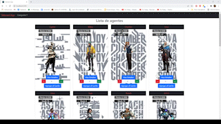
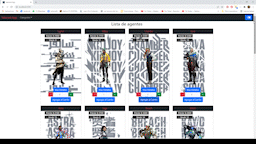
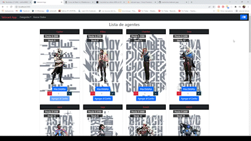
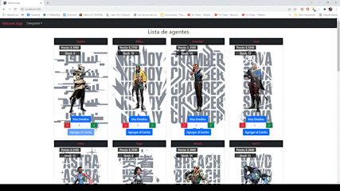
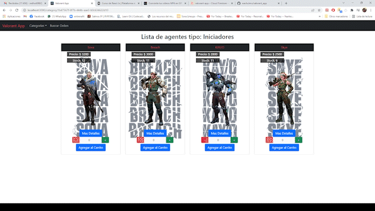
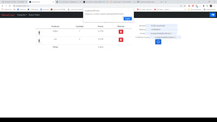

# valorant_app

## Descripción
E-commerce basado en el video juego Valorant, en el cual puedes agregar a los agentes a tu carrito y posteriormente generar la orden de compra.
## Overviews
### Agregar a carrito, filtrar por categorías y ver el detalle del producto:

<!-- 
### Filtrar categorias y ver detalle de producto
 -->

### Ver carrito, eliminar producto del carro, validación de datos requeridos para finalizar compra con habilitación de boton Finalizar Compra


### Productos fuera de stock bloqueados


### Producto no encontrado (no existe)


### Buscar orden


----

## Deploy
**WEB**: 

## Architecture
- **React**
- **Firebase** : 7.24.0 - Para la conexión con los datos almacenados en firestore
- **Bootstrap** : 5.0.2 - Framework para usar estilos css y sistema de grilla
- **FontAwesome** : v5.10.0 - Íconos
- **react-hook-form** :7.26.1 - Para facilitar el uso de form
- **react-router-dom** : 5.3.0 - Para el uso de rutas (/cart, /item, etc)
## Structure

```bash
VALORANT_APP

├───node_modules
│  
├───public
└───src 
    ├───components
    ├───contexts
    ├───data
    ├───firebase
    ├───hooks
    ├───pages
    ├───providers
    └───utils
```

# Running

## Requirements

- **Node**: v12.18.0

- **npm**: 6.14.4

## Prepare
```bash
git clone https://github.com/wachuleru/valorant_app.git
cd valorant_app
# crear en /src/firebase el archivo conector.js que está en el comentario de la entrega final del proyecto, no se incluye ya que son datos para acceder a firebase y son sensibles
npm install

```

## Development

Para correr valorant_app

```bash
npm run start
```
